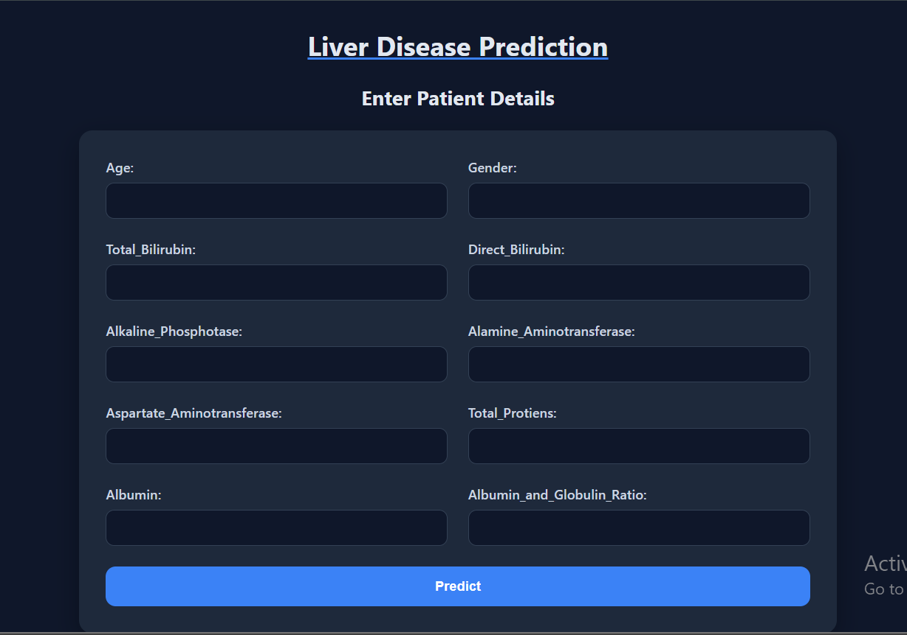
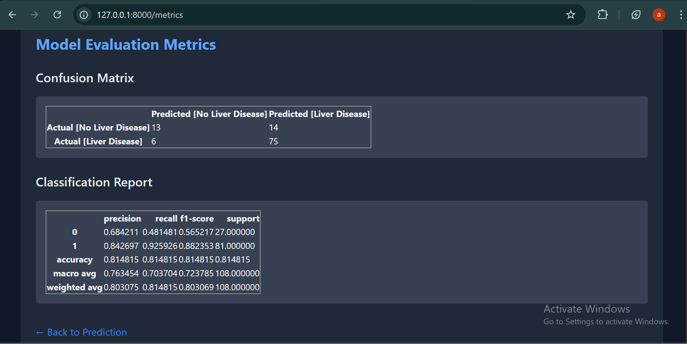
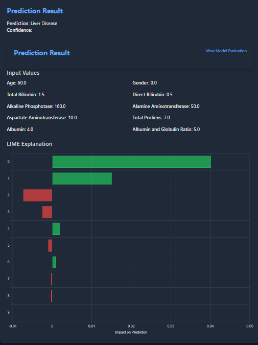

# Liver Disease Prediction

This project focuses on predicting liver disease using the Indian Liver Patient Dataset. It follows a full machine learning workflow—from exploratory data analysis to model deployment using a FastAPI backend with an interactive HTML frontend.

## Problem Statement

Early detection of liver disease is crucial for timely medical intervention. This project aims to build a robust binary classification model to predict whether a patient is likely to have a liver disease based on medical attributes.

---

## Project Structure
```
Liver Disease Prediction/
│
├── app/
│   ├── static/                    # Static assets (if any)
│   ├── templates/                # HTML templates for the web interface
│   │   ├── form.html             # User input form
│   │   ├── result.html           # Prediction result page
│   │   └── metrics.html          # Model metrics (accuracy, confusion matrix, etc.)
│   ├── main.py                   # FastAPI backend logic
│   ├── Ada_Model.pkl             # Final trained model (AdaBoost)
│   ├── X_test.pkl                # X_test used for evaluation
│   └── y_test.pkl                # y_test used for evaluation
│
├── images/                       # Screenshots or plots (optional)
│
├── notebooks/                    # Jupyter Notebooks for experimentation
│   ├── ExplorationAndBaselineModel.ipynb
│   ├── DataPrepration.ipynb
│   └── FinalCode.ipynb
│
├── indian_liver_patient.csv      # Original dataset from Kaggle
├── cleaned_indian_liver_patient.csv  # Cleaned version after preprocessing
└── README.md
```
---

---

## Workflow Summary

### 1. Exploratory Data Analysis & Baseline Modeling

Notebook: `notebooks/ExplorationAndBaselineModel.ipynb`

- **Dataset:** Indian Liver Patient Dataset (ILPD)  
- **Target Variable:** `Dataset` (1: Liver disease, 2: No disease)  
- Key tasks:  
  - Null value analysis  
  - Correlation heatmaps  
  - Feature distributions by gender and class  
  - Baseline models: DecisionTreeClassfier
- **Insight:** Initial model performance was limited due to noisy and mislabeled and Unbala data.

### 2. Data Cleaning and Integrity Check

Notebook: `notebooks/DataPreparation.ipynb`

- Detected and removed mislabeled rows through EDA and statistical inspection.  
- Feature engineering steps:  
  - Converted `Dataset` from {1, 2} to {1, 0}  
  - One-hot encoding for `Gender`  
- Exported cleaned dataset: `cleaned_indian_liver_patient.csv`

### 3. Final Modeling and Evaluation

Notebook: `notebooks/FinalCode.ipynb`

- Applied **SMOTEN** to address class imbalance in categorical features.  
- Trained multiple classifiers; selected **AdaBoostClassifier** based on evaluation metrics.  
- Evaluation included:  
  - Accuracy  
  - Precision, Recall, F1-score  
  - Confusion Matrix  
  - ROC-AUC (optional)

---

## Model Interpretability (LIME)

- Used **LIME (Local Interpretable Model-agnostic Explanations)** to explain individual predictions.  
- Integrated into `main.py` to generate local explanation plots for user inputs.  
- LIME visualizations are rendered dynamically inside **`result.html`**:  
  - Users can view **which features influenced** the prediction and **by how much**.  
  - Enhances transparency and trust in model predictions.

---

## Deployment (FastAPI App)

- **Directory:** `app/`  
- **Frontend:** HTML templates:  
  - `form.html`: User input form  
  - `result.html`: Displays prediction **+ LIME explanation**  
  - `metrics.html`: Shows model performance metrics  
- **Backend:** FastAPI  
  - Loads serialized AdaBoost model (`Ada_Model.pkl`)  
  - Accepts user input and returns prediction with probability and explanation  
  - Serves evaluation metrics on demand  

### Run the app locally

```bash
cd app
uvicorn main:app --reload
```

---

## Workflow Summary

### 1. Exploratory Data Analysis & Baseline Modeling

Notebook: `notebooks/ExplorationAndBaselineModel.ipynb`

- **Dataset:** Indian Liver Patient Dataset (ILPD)  
- **Target Variable:** `Dataset` (1: Liver disease, 2: No disease)  
- Key tasks:  
  - Null value analysis  
  - Correlation heatmaps  
  - Feature distributions by gender and class  
  - Baseline models: Logistic Regression, Random Forest, SVM  
- **Insight:** Initial model performance was limited due to noisy and mislabeled data.

### 2. Data Cleaning and Integrity Check

Notebook: `notebooks/DataPreparation.ipynb`

- Detected and removed mislabeled rows through EDA and statistical inspection.  
- Feature engineering steps:  
  - Converted `Dataset` from {1, 2} to {1, 0}  
  - One-hot encoding for `Gender`  
  - Removed outliers for numerical stability  
- Exported cleaned dataset: `cleaned_indian_liver_patient.csv`

### 3. Final Modeling and Evaluation

Notebook: `notebooks/FinalCode.ipynb`

- Applied **SMOTEN** to address class imbalance in categorical features.  
- Trained multiple classifiers; selected **AdaBoostClassifier** based on evaluation metrics.  
- Evaluation included:  
  - Accuracy  
  - Precision, Recall, F1-score  
  - Confusion Matrix  
  - ROC-AUC (optional)

---

## Model Interpretability (LIME)

- Used **LIME (Local Interpretable Model-agnostic Explanations)** to explain individual predictions.  
- Integrated into `main.py` to generate local explanation plots for user inputs.  
- LIME visualizations are rendered dynamically inside **`result.html`**:  
  - Users can view **which features influenced** the prediction and **by how much**.  
  - Enhances transparency and trust in model predictions.

---

## Deployment (FastAPI App)

- **Directory:** `app/`  
- **Frontend:** HTML templates:  
  - `form.html`: User input form  
  - `result.html`: Displays prediction **+ LIME explanation**  
  - `metrics.html`: Shows model performance metrics  
- **Backend:** FastAPI  
  - Loads serialized AdaBoost model (`Ada_Model.pkl`)  
  - Accepts user input and returns prediction with probability and explanation  
  - Serves evaluation metrics on demand  

### Run the app locally

```bash
cd app
uvicorn main:app --reload
```
Visit: http://127.0.0.1:8000
---
Dependencies

pandas==2.2.2
numpy==1.26.4
scikit-learn==1.5.1
imbalanced-learn==0.12.3
matplotlib==3.9.2
fastapi==0.115.1
uvicorn[standard]
joblib==1.4.2
lime==0.2.0.1

```
pip install -r requirements.txt
```
## Model Insights
---
AdaBoost handled tabular and mildly imbalanced data effectively.

SMOTEN helped equalize class representation during training.

LIME added interpretability to individual predictions.
---
## Key Learnings

Label quality is as important as model choice—data integrity matters.

Class imbalance distorts metrics; SMOTE-like techniques are essential.

Explaining predictions (via LIME) is crucial in sensitive domains like healthcare.

Deployment requires more than a good model: usability and interpretability are key.

---

## Screenshots

**1. Input Form**  


**2. Model Metrics**  


**3. Prediction Result**  


